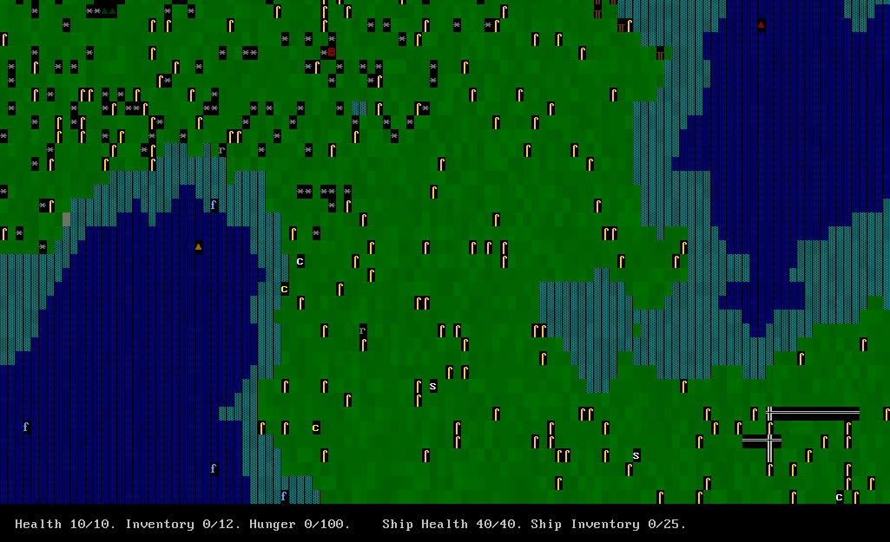
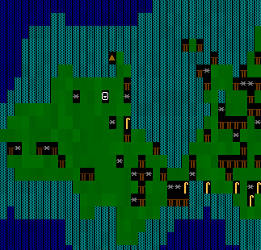
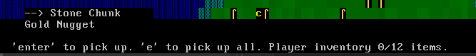
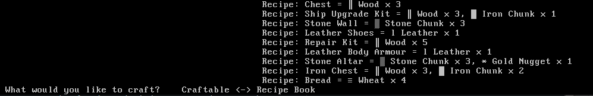

# Ship Roguelike
A seafaring roguelike where the player alternates between land and sea adventures. 

Land and sea are randomly generated via noise and voronoi diagrams, giving a new experience for each run. There are various ruins of buildings placed around the map also with loot in.
The player can craft walls, chests, armour and weapons as well as upgrade their ship to gain more storage space and hitpoints. 

The player starts at a random position at see (see the orange triangle players ship at sea):

By moving to the shore the player can disembark (see the parked ship and player now on land):

After exploring you can attack enemies and chop down trees, interacting via the 'g' key to 'grab':

Gathering resources from crafting allows you to create new items, build and upgrade your ship. Press 'c' to 'craft':

To win the game you must build a stone alter, this will open a portal in the sea somewhere which you can navigate to.

# To Run/Play The Game
1. Import as gradle project
2. run rogue.run.RogueLikeMain

# Architecture
The game is created using an ECS architecture. This allows for all systems to be modular and interact with large amounts of items and effects.
See 'Code Tour' below for a more in depth look at the code.

Features include:
- Noise based world generation, giving a new experience for each play through
- Loot system allowing entities to drop from a predefined loot table
- Crafting system allowing recipies to be learned by the player, building up a recipe-book
- Hunger system which requires player to gather food to stay alive
- Gathering and building system, allowing the player to harvest loot and resources and craft items, storage, armour, walls, upgrades etc.
- Extensible world placement system which can take prefabricated locations such as ruins with loot, and randomly distribute them across the world map

# Code Tour
Broken down by java modules:
- rogue.ai = houses all AI, this deals with onEnter and nextMove for both the player and the non player controlled entities in the game
- rogue.components = the components of the ECS pattern, they function as both data stores and events to be processed by systems
- rogue.crafting = crafting classes, recipes and recipe books to group recipes
- rogue.entities = the entities of the ECS pattern, groups together and initialises components. Each entity class has a unique EntityId
- rogue.environment = world generation code. The world grid is a 2D array of entities, on top of which other generation is applied
- rogue.factories = factories to create various objects for both the ECS pattern and tiles/entities/recipes etc.
- rogue.familygeneration = procedural family generation code, to create a family tree
- rogue.loot = loot table creation and loot drop logic
- rogue.render = the render grid, which is written to screen each update
- rogue.run = RogueLikeMain, with the Main function in to run the game
- rogue.screens = various game screens. The main one being PlayScreen
- rogue.systems = the systems of the ECS pattern, to process each tick all components + updates (remember components also act as events)
- rogue.util = utilities to create various objects and test conditions such as isLand etc.

